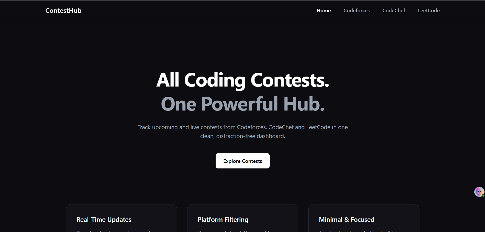
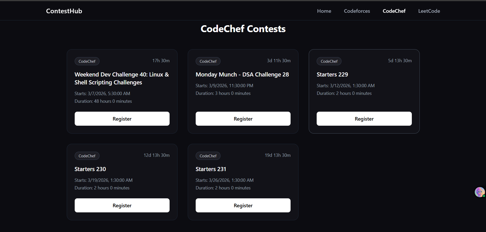
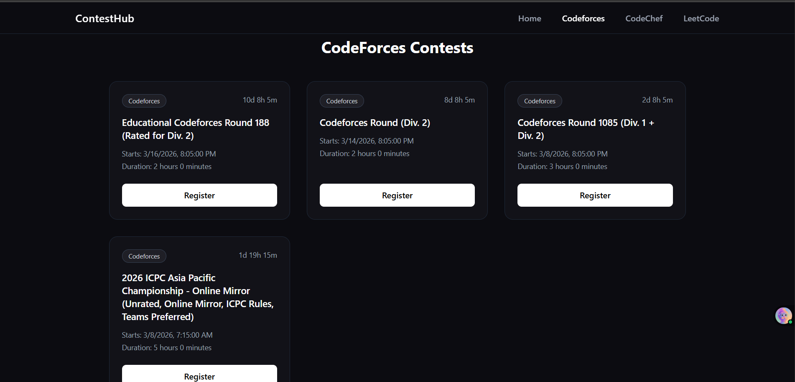
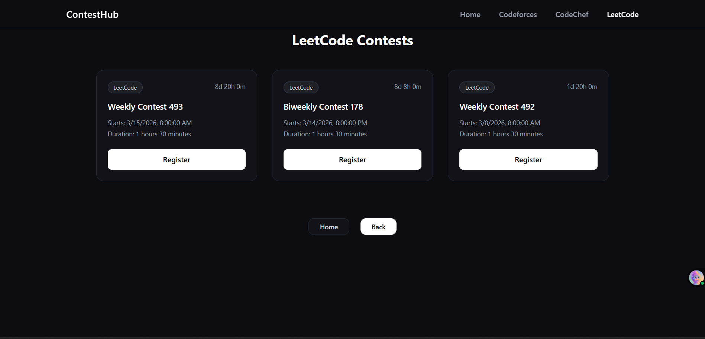

## 🚀 ContestHub – Competitive Programming Contest Aggregator

A modern web platform that aggregates competitive programming contests from multiple platforms into one place so developers never miss a contest again.

🌐 Live Demo:
https://scintillating-torrone-d4e441.netlify.app/

## 📌 Overview

Competitive programmers often participate in contests hosted on different platforms such as Codeforces, CodeChef, LeetCode, AtCoder, and more. Tracking all these contests individually can be inconvenient.

ContestHub simplifies this by providing a single unified dashboard where users can view upcoming contests from multiple platforms.

The goal of this project is to make the competitive programming journey more organized and accessible.

## ✨ Features

✅ Aggregates contests from multiple platforms
✅ Clean and minimal UI
✅ Quick access to contest links
✅ Responsive design for desktop and mobile
✅ Fast loading and optimized interface
✅ Easy-to-read contest information

## App Preview

## Tech Stack used->

## Frontend

React.js

Tailwind CSS

ShadCN UI

## Data Source

  Contest APIs- by @Mihir2423

## Deployment

Netlify

## Heartful gratitude and thanks to @Mihir2423 for the backend-Contests API
